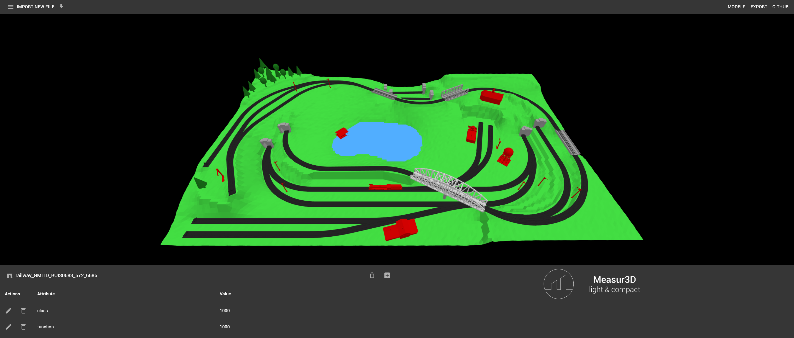

**Measur3D - client**
----
This API makes it possible to manipulate compact city models in a document-oriented database.

Measur3D relies on JavaScript libraries such as follows for the client side:

* [ReactJS](https://reactjs.org/) - A JavaScript library for building user interfaces
* [ThreeJS](https://threejs.org/) - A lightweight 3D library with a default WebGL renderer
* [Axios](https://github.com/axios/axios) - A promise based HTTP client for the browser and node.js

The client should be launched after the server because of automatic connections. Currently, ports and hosting are the default ones.

The client is built following an event-driven architecture. An event bus centralizes all the subscriptions and events.

